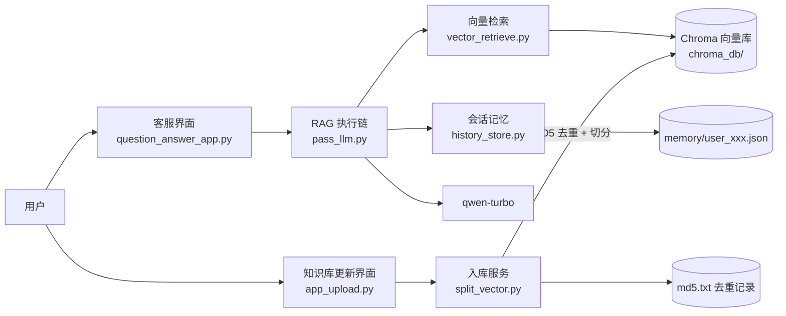

# RAG 项目实战 —— 服装智能客服

一个基于 **RAG（检索增强生成）+ LCEL 执行链 + 会话记忆** 的服装领域智能客服项目。客服可以基于内置的服装知识库（尺码推荐、洗涤养护、颜色选择）回答用户问题，并在多轮对话中记住上下文（例如用户说过自己的体重，后续可以直接追问推荐结果），还提供了独立的「知识库更新」页面，支持在线为向量库补充新资料。

> 本项目位于 `AI_leaning/01_RAG项目实战`，是 RAG 学习实战项目。

---

## 功能特性

- **知识库问答**：基于内置服装资料（尺码推荐 / 洗涤养护 / 颜色选择）检索增强回答，回答有据可依。
- **多轮会话记忆**：自定义 JSON 文件会话记忆，按用户（`session_id`）分别保存历史对话，支持跨轮次追问。
- **流式输出**：客服回答以流式逐字渲染到聊天界面。
- **在线更新知识库**：Streamlit 页面支持上传 TXT 文件，自动去重（MD5）并入库到向量库。
- **MD5 去重**：相同内容不会重复导入向量库。

---

## 技术栈

| 分类 | 技术 |
| --- | --- |
| 界面 | Streamlit |
| RAG 链路 | LangChain LCEL（`RunnablePassthrough` / `RunnableLambda` / `RunnableWithMessageHistory`） |
| 大模型 | 通义千问 `qwen-turbo`（OpenAI 兼容接口，`ChatOpenAI`，流式） |
| 向量库 | Chroma（本地持久化，`chroma_db/`） |
| 文本嵌入 | DashScope `text-embedding-v4` |
| 文本处理 | `RecursiveCharacterTextSplitter` 切分、MD5 内容去重 |
| 会话记忆 | 自定义 `BaseChatMessageHistory` 子类，JSON 文件持久化（`memory/`） |
| 其他 | python-dotenv（环境变量） |

---

## 系统架构



**一次典型对话的流转：**

1. 用户在客服界面提问；
2. `ragservice` 把当前问题送入 LCEL 链：**检索**（向量库取 Top-3 片段）→ **拼装**（上下文 + 历史消息 + 当前问题）→ **提示词模板** → **大模型** → **流式输出**；
3. 回答的同时，`RunnableWithMessageHistory` 通过 `history_store` 把对话写入对应 `session_id` 的 JSON 文件；
4. 用户追问时，历史消息会被自动注入提示词，实现多轮对话记忆。

---

## 目录结构

```
01_RAG项目实战/
├── question_answer_app.py     # 客服聊天界面（Streamlit，流式输出，会话记忆 user_002）
├── app_upload.py              # 知识库更新界面（Streamlit，上传 TXT 入库）
├── pass_llm.py                # RAG 核心：LCEL 执行链（检索→拼装→模型→输出）+ 会话记忆
├── split_vector.py            # 入库服务：文本切分、MD5 去重、写入 Chroma
├── vector_retrieve.py         # 向量检索封装（VectorRetrieve）
├── history_store.py           # 会话记忆：JSON 文件持久化的 ChatMemoryHistory
├── config_data.py             # 全局配置（路径、向量库、切分、模型、会话参数）
├── data/                      # 服装知识库（TXT）
│   ├── 尺码推荐.txt            # 身高体重 → 建议尺码
│   ├── 洗涤养护.txt            # 衣物洗涤与养护知识
│   └── 颜色选择.txt            # 颜色搭配与选择建议
├── memory/                    # 会话记忆持久化目录（user_001 / user_002）
├── chroma_db/                 # Chroma 向量库持久化目录（运行时生成）
├── md5.txt                    # 已入库内容的 MD5 记录（去重凭证）
└── README.md                  # 本文档
```

---

## 快速开始

### 1. 环境要求

- Python 3.10+
- 阿里云百炼（DashScope）账号：用于大模型与文本嵌入

### 2. 安装依赖

```bash
pip install streamlit langchain langchain-core langchain-chroma langchain-community langchain-text-splitters langchain-openai chromadb python-dotenv
```

### 3. 配置环境变量

在项目根目录创建 `.env` 文件（或设置系统环境变量）：

```ini
# 文本嵌入 API Key（text-embedding-v4）
DASHSCOPE_API_KEY=你的_API_Key

# 大模型 API Key（qwen-turbo）
ALIBL_API_KEY=你的_API_Key
# OpenAI 兼容接口地址，例如 https://dashscope.aliyuncs.com/compatible-mode/v1
ALIBL_BSUL=你的_base_url
```

### 4. 初始化知识库

内置的 `data/` 知识库文件需要先入库。可以在「知识库更新服务」页面逐个上传，也可以直接执行入库脚本（以尺码推荐为例）：

```bash
python split_vector.py
```

脚本会读取 `data/尺码推荐.txt`，切分后写入 `chroma_db/`，并把内容 MD5 记录到 `md5.txt`。重复入库相同内容会提示「内容已经存在知识库中」。

### 5. 启动智能客服

```bash
streamlit run question_answer_app.py
```

### 6. 更新知识库（可选）

```bash
streamlit run app_upload.py
```

上传任意 TXT 文件即可在线追加知识库内容（MD5 相同的文件会自动跳过）。

---

## 使用示例

**第一轮（告知信息）：**

```
用户：我体重 180 斤，帮我推荐尺码
客服：（检索尺码推荐知识）根据您的体重，建议选择 4XL 尺码……
```

**第二轮（基于记忆追问）：**

```
用户：你知道我的身高吗？
客服：（结合历史消息）您之前提到过体重 180 斤，但还没有提供身高信息，请问您的身高是多少？
```

---

## 核心机制详解

### 1. RAG 执行链（`pass_llm.py`）

使用 LCEL 组装：

```
{
  "input": RunnablePassthrough(),                      # 透传消息列表
  "context": format_text | retriever | format_docment  # 取当前问题 → 向量检索 → 拼装上下文
}
| format_prompt        # 分离当前问题与历史消息，整理为提示词字段
| prompt_template      # system(参考资料+历史) + history 占位 + user(当前问题)
| print_prompt         # 调试打印
| llm                 # qwen-turbo（流式）
| StrOutputParser()    # 输出纯文本
```

再通过 `RunnableWithMessageHistory(chain, get_history, ...)` 注入会话记忆：
- `input_messages_key="input"`：从输入中提取当前问题；
- `message_history_key="history"`：把历史消息填入提示词模板的 `MessagesPlaceholder`。

### 2. 会话记忆（`history_store.py`）

- 自定义 `ChatMemoryHistory(BaseChatMessageHistory)`，一个 `session_id` 对应 `memory/` 下的一个 JSON 文件；
- `add_messages()` 将全部消息序列化（`message_to_dict`）后整体写回文件；
- `messages` 属性读取文件并反序列化（`messages_from_dict`），文件不存在时返回空列表；
- 通过 `RunnableWithMessageHistory` 的 `config={"configurable": {"session_id": ...}}` 指定记忆身份。

### 3. 入库服务（`split_vector.py`）

- 计算文本内容 MD5，若已存在于 `md5.txt` 则跳过（内容级去重）；
- 长文本用 `RecursiveCharacterTextSplitter` 切块（`chunk_size=1000`、`chunk_overlap=100`），短文本整段入库；
- 每个片段附带元数据：来源文件名、入库时间、操作人（`OPERATOR`）。

### 4. 向量检索（`vector_retrieve.py`）

- `VectorRetrieve` 封装 Chroma 连接与 `as_retriever(search_kwargs={"k": 3})`，只对外暴露检索器。

---

## 配置说明（`config_data.py`）

| 配置项 | 值 / 说明 |
| --- | --- |
| `COLLECTION_NAME` | 向量集合名：`RAG` |
| `PERSIST_DIRECTORY` | 向量库目录：`chroma_db/` |
| `CHUNK_SIZE` / `CHUNK_OVERLAP` | 切分块大小 1000 / 重叠 100 |
| `TOP_K` | 检索返回片段数：3 |
| `EMBEDDING_MODEL` | `text-embedding-v4` |
| `CHAT_MODEL` | `qwen-turbo` |
| `OPERATOR` | 入库元数据中的操作人标识 |
| `session_config` | 测试默认会话 ID：`user_001` |

---

## 已知限制与注意事项

- `config_data.py` 中切分分隔符写为 `"/n/n"`、`"/n"`（字面反斜杠+字母 n），并非真正的换行符 `"\n\n"`、`"\n"`，可能导致按换行切分不生效；如需精确切分请改为 `"\n\n"`、`"\n"`。
- 会话记忆为「整文件覆盖写」方式，多端并发写同一 `session_id` 可能互相覆盖。
- `pass_llm.py` 导入了 `ChatTongyi` 但实际使用 `ChatOpenAI`（兼容接口），可按需清理。
- 知识库更新页面目前仅支持 TXT 格式（`type=["txt"]`）。
- `memory/` 下的 JSON 文件为明文对话记录，生产环境注意隐私与安全。

---

## License

本项目为学习 / 实战示例项目，仅用于演示 RAG + LCEL + 会话记忆的客服系统构建思路。
