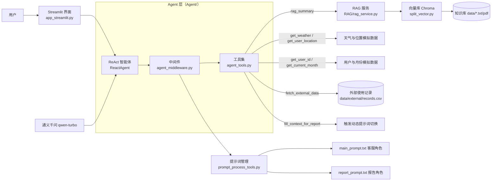

# 扫地机器人智能客服

一个基于 **LangChain Agent + RAG（检索增强生成）** 的扫地机器人 / 扫拖一体机器人智能客服系统。它既能像普通客服一样回答产品使用、故障排除、选购、维护保养等专业问题，也能根据用户的个人使用记录自动生成「使用情况报告与保养建议」。

项目使用 **ReAct（思考→行动→观察→再思考）** 模式的智能体，配合 7 个工具与 3 个中间件，实现知识问答、环境适配咨询、个性化报告生成三大能力，并通过 Streamlit 提供简洁的 Web 聊天界面。

---

## 功能特性

- **专业知识问答**：通过 RAG 向量检索（Chroma + 文本嵌入），从内置知识库（产品 100 问、故障排除、维护保养、选购指南等）中检索资料，再由大模型总结回答，回答有据可依。
- **环境适配咨询**：自动获取用户所在城市与天气信息，判断当前环境是否适合使用扫地机器人，并给出针对性建议。
- **个性化使用报告**：输入用户 ID 和月份（或让智能体自动获取），调取该用户的外部使用记录（清洁效率、耗材状态、同类对比等），生成 Markdown 格式的《扫地机器人使用情况报告与保养建议》。
- **动态提示词切换**：通过中间件感知「报告生成」场景，自动从普通客服提示词切换到报告写作提示词，一套系统两种角色。
- **知识库增量管理**：基于文件 MD5 实现去重入库，文件未变化时不会重复导入向量库。

---

## 技术栈

| 分类 | 技术 |
| --- | --- |
| 界面 | Streamlit |
| Agent 框架 | LangChain `create_agent` + LangGraph（工具调用、中间件、流式输出） |
| 大模型 | 通义千问 `qwen-turbo`（OpenAI 兼容接口，`ChatOpenAI`） |
| 向量库 | Chroma（本地持久化，`output/chroma_bd`） |
| 文本嵌入 | DashScope `text-embedding-v4` |
| 文本处理 | RecursiveCharacterTextSplitter 切分、PyMuPDFLoader / TextLoader 加载 |
| 其他 | python-dotenv（环境变量）、hashlib（MD5 去重） |

---

## 系统架构



**一次典型对话的流转：**

1. 用户在 Streamlit 界面输入问题；
2. `ReactAgent` 按 ReAct 流程思考，决定是否调用工具；
3. 普通问题 → 调用 `rag_summary` 检索知识库并总结回答；
4. 环境问题 → 调用 `get_user_location` + `get_weather` 后回答；
5. 报告需求 → 依次调用 `get_user_id` → `get_current_month` → `fill_context_for_report`（触发中间件切换报告提示词）→ `fetch_external_data`，最终生成报告。

---

## 目录结构

```
扫地机器人智能客服/
├── app_streamlit.py              # Streamlit 入口，聊天界面
├── Agent/                        # 智能体层
│   ├── react_agent.py            # ReactAgent：组装模型、工具、中间件、提示词
│   ├── agent_tools.py            # 7 个工具的定义
│   └── agent_middleware.py       # 3 个中间件（日志、工具监控、动态提示词）
├── config/                       # 全局配置
│   ├── PATH.py                   # 项目根路径、MD5 记录文件路径
│   ├── model.py                  # 大模型（qwen-turbo）配置
│   ├── RAG_chroma.py             # 向量库/嵌入/切分参数配置
│   └── load_requested_files.py   # 允许入库的文件类型（.pdf/.txt）
├── RAG/                          # 检索增强生成
│   ├── split_vector.py           # VectorService：向量库、切分、MD5 去重、入库
│   └── rag_service.py            # RagService：检索 → 拼装 → 提示词 → 模型 → 总结
├── process_tools/                # 处理工具
│   ├── files_process_tools.py    # 文件加载（pdf/txt）、MD5 计算
│   └── prompt_process_tools.py   # 提示词文件加载（RAG/客服/报告）
├── prompt/                       # 提示词文件
│   ├── main_prompt.txt           # 客服角色系统提示词（普通问答）
│   ├── report_prompt.txt         # 报告写作提示词（报告场景动态切换）
│   └── rag_summarize.txt         # RAG 总结提示词
├── data/                         # 数据
│   ├── 扫地机器人100问.pdf        # 知识库：产品问答
│   ├── 扫地机器人100问2.txt       # 知识库：产品问答（补充）
│   ├── 扫拖一体机器人100问.txt    # 知识库：扫拖一体问答
│   ├── 故障排除.txt               # 知识库：故障检测与修复
│   ├── 维护保养.txt               # 知识库：维护保养
│   ├── 选购指南.txt               # 知识库：选购指南
│   └── external/
│       └── records.csv           # 外部数据：用户每月使用记录（清洁效率/耗材/对比）
├── output/                       # 运行时产物
│   ├── chroma_bd/                # Chroma 向量库持久化目录
│   └── md5.txt                   # 已入库文件的 MD5 记录（去重凭证）
└── README.md                     # 本文档
```

---

## 快速开始

### 1. 环境要求

- Python 3.10+（项目代码在 3.13 下开发）
- 阿里云百炼（DashScope）账号：用于大模型与文本嵌入服务

### 2. 安装依赖

在项目根目录执行：

```bash
pip install streamlit langchain langchain-core langgraph langchain-openai langchain-chroma langchain-community langchain-text-splitters chromadb python-dotenv pymupdf
```

### 3. 配置环境变量

在项目根目录创建 `.env` 文件（或设置系统环境变量），内容如下：

```ini
# 大模型 API Key（qwen-turbo）
ALIBL_API_KEY=你的_API_Key
# 大模型 OpenAI 兼容接口地址，例如
# ALIBL_BSUL=https://dashscope.aliyuncs.com/compatible-mode/v1
ALIBL_BSUL=你的_base_url

# 文本嵌入 API Key（text-embedding-v4）
DASHSCOPE_API_KEY=你的_API_Key
```

> 说明：`ALIBL_API_KEY` / `ALIBL_BSUL` 为代码中实际使用的环境变量名（见 `config/model.py`），按上述名称配置即可。`config/RAG_chroma.py` 会自动通过 `load_dotenv()` 加载根目录的 `.env` 文件。

### 4. 构建知识库（首次运行前）

将知识库文件放入 `data/` 目录（已内置 6 份资料），然后执行：

```bash
python -m RAG.split_vector
```

脚本会读取 `data/` 下所有 `.pdf` / `.txt` 文件，进行文本切分后写入向量库 `output/chroma_bd/`，并将每个文件的 MD5 记录到 `output/md5.txt`。重复执行时，MD5 未变化的文件会自动跳过（去重入库）。

### 5. 启动客服

```bash
streamlit run app_streamlit.py
```

浏览器打开后即可与客服对话。也可以不带界面直接测试智能体：

```bash
python -m Agent.react_agent
```

---

## 使用示例

**普通问答：**

```
用户：小户型适合什么样的扫地机器人？
客服：结合知识库资料，小户型建议优先考虑机身厚度低、沿边清扫能力强的机型……
```

**环境适配咨询：**

```
用户：南京最近下雨，用扫地机器人要注意什么？
客服：（自动获取所在城市与天气）南京当前天气……湿度较高，建议……
```

**生成使用报告：**

```
用户：生成报告
客服：（自动获取用户 ID 与当前月份 → 调取使用记录）生成《扫地机器人使用情况报告与保养建议》
```

用户也可以指定 ID 和时间范围，例如「生成用户 1003 今年 1 月的使用报告」，智能体会跳过获取步骤直接查询。

---

## 核心机制详解

### 1. ReAct 智能体（`Agent/react_agent.py`）

通过 LangChain `create_agent` 组装：

- **模型**：`qwen-turbo`（`config/model.py`）
- **工具**：7 个
- **中间件**：3 个
- **系统提示词**：由 `prompt_process_tools.load_system_prompts()` 动态加载

`output_stream()` 以 `stream_mode="values"` 流式输出模型消息，供 Streamlit 逐字展示。注意：输入必须使用 `{"messages": [HumanMessage(...)]}` 结构，直接传 `{"role": "user", ...}` 会导致用户消息丢失。

### 2. 工具集（`Agent/agent_tools.py`）

| 工具 | 入参 | 作用 |
| --- | --- | --- |
| `rag_summary` | `query` | 从向量库检索知识并总结回答（核心问答工具） |
| `get_weather` | `city` | 获取城市天气（当前为模拟数据） |
| `get_user_location` | 无 | 获取用户所在城市（模拟，南京/北京/南昌） |
| `get_user_id` | `id` 可选 | 获取用户 ID（模拟，1001~1010） |
| `get_current_month` | `month` 可选 | 获取当前月份（模拟，2025-01~2025-12） |
| `fetch_external_data` | `user_id`, `month` | 从 `records.csv` 读取用户某月使用记录 |
| `fill_context_for_report` | 无 | 标记「报告生成」场景，触发提示词切换（报告流程的前置工具） |

### 3. 中间件（`Agent/agent_middleware.py`）

| 中间件 | 类型 | 作用 |
| --- | --- | --- |
| `monitor_tool` | `wrap_tool_call` | 打印工具调用与参数；当调用 `fill_context_for_report` 时，把 `runtime.context["report"]` 置为 `True` |
| `log_before_model` | `before_model` | 模型调用前打印最新消息类型与内容，便于调试 |
| `report_prompt` | `dynamic_prompt` | 每次生成提示词前判断：`context["report"] == True` 时加载报告提示词，否则加载普通客服提示词 |

### 4. 动态提示词切换（报告场景）

报告生成遵循固定流程：`获取用户ID → 获取报告月份 → fill_context_for_report → fetch_external_data`。

其中 `fill_context_for_report` 是**必调前置工具**：只有调用它，`monitor_tool` 中间件才会设置 `report=True`，`report_prompt` 中间件才会把提示词切换为报告写作角色。未调用该工具禁止执行 `fetch_external_data` 及生成报告（提示词中有强约束）。

### 5. RAG 检索（`RAG/`）

- `VectorService`（`split_vector.py`）：连接 Chroma 向量库，`RecursiveCharacterTextSplitter` 按 `["\n\n", "\n", ".", "。", "!", "?", " ", ""]` 切分，`chunk_size=1000`、`chunk_overlap=100`，检索取前 `TOP_N=3` 条；
- `RagService`（`rag_service.py`）：检索 → 将资料拼装为「参考资料」上下文 → 填充 `rag_summarize.txt` 提示词 → 送入大模型总结 → 返回纯文本答案；
- 提示词约束总结内容必须基于参考资料，不编造、不扩充问题范围。

### 6. 知识库去重（MD5）

`files_process_tools.get_files_md5()` 计算每个文件的 MD5，`VectorService.check_md5()` 比对 `output/md5.txt` 中的记录。已入库的文件跳过导入，未入库的新文件或修改过的文件（MD5 变化）才会重新入库。

---

## 配置说明（`config/`）

| 文件 | 配置项 | 说明 |
| --- | --- | --- |
| `generate_model.py` | `LLM` | 大模型：`qwen-turbo`，temperature=0.5 |
| `RAG_chroma.py` | `EMBEDDING_MODEL` | 嵌入模型：`text-embedding-v4` |
| `RAG_chroma.py` | `COLLECTION_NAME` | 向量集合名：`agent` |
| `RAG_chroma.py` | `PERSIST_DIRECTORY` | 向量库目录：`output/chroma_bd` |
| `RAG_chroma.py` | `CHUNK_SIZE` / `CHUNK_OVERLAP` / `TOP_N` | 切分块大小 / 重叠 / 检索条数 |
| `load_requested_files.py` | `REQUESTED_FILES` | 入库文件类型：`.pdf`、`.txt` |

---

## 数据说明

- **知识库（`data/`）**：6 份扫地/扫拖机器人资料（产品问答、故障排除、维护保养、选购指南等），是 RAG 检索的来源；
- **外部数据（`data/external/records.csv`）**：10 个模拟用户（1001~1010）在 2025-01 起的多个月度使用记录，包含家庭特征、清洁效率、耗材状态、同类对比等字段，是报告生成的数据来源；
- **模拟工具**：天气、用户位置、用户 ID、当前月份均为随机模拟数据，演示用；接入真实数据时只需替换对应工具函数的实现。

---

## 已知限制与注意事项

- `get_weather`、`get_user_id`、`get_user_location`、`get_current_month` 返回的是**模拟数据**，用于演示工具调用链路，非真实数据；
- `fetch_external_data` 仅覆盖 `records.csv` 中存在的 `用户ID × 月份` 组合，查询不存在的组合会抛出 `KeyError`（智能体可据此判断数据缺失）；
- `ALIBL_API_KEY` / `ALIBL_BSUL` 为代码中原有的环境变量命名，若与实际服务商不一致，请按 `config/model.py` 调整；
- 报告生成的固定流程依赖提示词约束与中间件配合，手动绕过 `fill_context_for_report` 会导致提示词无法切换到报告角色；
- 首次运行前必须执行知识库入库脚本，否则向量库为空，`rag_summary` 检索不到内容。

---

## License

本项目为学习 / 实战示例项目，仅用于演示 Agent + RAG 的客服系统构建思路。
