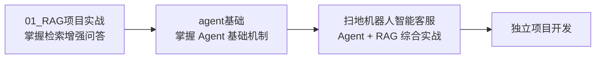

# AI_leaning —— AI 应用开发学习项目合集

本目录是作者系统学习 **AI 应用开发（大模型 + LangChain 生态）** 的实战项目合集，围绕两条主线循序渐进：

1. **RAG（检索增强生成）** —— 让大模型基于私有知识库回答问题；
2. **Agent（智能体）** —— 让大模型具备工具调用、自主思考与任务执行能力。

每个项目都是可运行的完整示例，代码内附详细注释，适合作为入门学习参考。

---

## 项目总览

```
AI_leaning/
├── 01_RAG项目实战/               # 主线一：RAG 检索增强生成
│   └── 服装智能客服               # RAG + LCEL 执行链 + 会话记忆
├── 02_Agent项目实战/             # 主线二：Agent 智能体
│   ├── agent基础/                # Agent 入门示例（001→004）
│   └── 扫地机器人智能客服/        # Agent + RAG 综合实战
└── README.md                    # 本文档
```

### 01_RAG项目实战 —— 服装智能客服

基于 RAG 的服装领域智能客服：内置尺码推荐、洗涤养护、颜色选择等知识库，通过向量检索增强回答，支持多轮会话记忆（JSON 文件持久化）与在线知识库更新。

- **核心技术**：LCEL 执行链、Chroma 向量库、DashScope 文本嵌入（text-embedding-v4）、通义千问 qwen-turbo、自定义会话记忆、MD5 内容去重
- **界面**：Streamlit（客服问答页 + 知识库更新页）
- 📄 详见 [01_RAG项目实战/README.md](./01_RAG项目实战/README.md)

### 02_Agent项目实战/agent基础 —— Agent 入门示例

从最小可运行 Agent 到中间件机制的四个循序渐进示例：

| 示例 | 知识点 |
| --- | --- |
| 001_Agent初体验 | `create_agent` 创建智能体、`@tool` 定义工具、invoke 运行 |
| 002_agent流式输出 | `agent.stream` 流式输出、观察工具调用信息 |
| 003_agent的React框架 | ReAct 框架：思考 → 行动 → 观察 → 再思考 |
| 004_agent的middlewire | 中间件：Agent / 模型 / 工具的全生命周期钩子 |

- **核心技术**：LangChain `create_agent` + LangGraph 运行时、qwen-turbo
- 📄 详见 [02_Agent项目实战/agent基础/README.md](./02_Agent项目实战/agent基础/README.md)

### 02_Agent项目实战/扫地机器人智能客服 —— Agent + RAG 综合实战

完整的扫地机器人智能客服系统：既能回答产品使用、故障排除、选购、保养等专业问题（RAG 知识问答），也能根据用户使用记录自动生成个性化使用报告（工具调用 + 动态提示词切换），通过 Streamlit 提供聊天界面。

- **核心技术**：ReAct 智能体（7 个工具 + 3 个中间件）、RAG 向量检索、动态提示词场景切换、MD5 增量入库
- 📄 详见 [02_Agent项目实战/扫地机器人智能客服/README.md](./02_Agent项目实战/扫地机器人智能客服/README.md)

---

## 推荐学习路径



1. **先学 RAG（01）**：理解「向量库检索 + 大模型生成」的基本链路，这是 Agent 工具能力的地基；
2. **再学 Agent 基础（agent基础）**：按 001→004 顺序理解工具调用、流式输出、ReAct 决策框架与中间件机制；
3. **最后综合实战（扫地机器人智能客服）**：把 RAG 与 Agent 结合，体会工具编排、场景化提示词切换等工程技巧。

---

## 环境说明

- **Python**：3.13（虚拟环境位于本目录 `.venv/`）
- **公共依赖**：LangChain 全家桶（langchain / langchain-core / langchain-openai / langchain-chroma / langchain-community / langchain-text-splitters）、LangGraph、Chroma、Streamlit、python-dotenv 等
- **模型服务**：阿里云百炼（DashScope）——大模型 `qwen-turbo`、文本嵌入 `text-embedding-v4`
- **环境变量**：各项目根目录下的 `.env` 文件（参考各项目 README），常用变量：

  ```ini
  ALIBL_API_KEY=...      # 大模型 API Key（qwen-turbo）
  ALIBL_BSUL=...         # OpenAI 兼容接口地址
  DASHSCOPE_API_KEY=...  # 文本嵌入 API Key
  ```

> 不同项目使用的环境变量略有差异（如 agent基础 还预留了 DeepSeek / 智谱 / Tavily 等配置），请以对应项目 README 为准。

---

## 快速开始

以「扫地机器人智能客服」为例：

```bash
cd 02_Agent项目实战/扫地机器人智能客服
pip install streamlit langchain langchain-core langgraph langchain-openai langchain-chroma langchain-community langchain-text-splitters chromadb python-dotenv pymupdf
# 配置 .env 环境变量
python -m RAG.split_vector        # 初始化知识库
streamlit run app_streamlit.py    # 启动客服
```

其余项目启动方式见各自 README。

---

## License

本目录内容为个人学习 / 实战示例，仅用于技术学习与演示。
